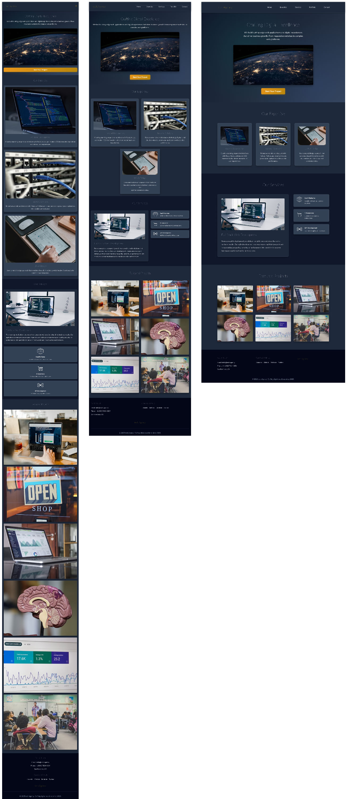

# Exercice Media Queries 3

## Installation

1. Cloner le repository
2. Ouvrir le dossier avec Visual Studio Code
3. Ouvrir une fenêtre de terminal dans Visual Studio Code et entrer la commande suivante :

```bash
npm install
```

## Travail

Depuis le terminal, entrer la commande suivante :

```bash
npm run dev
```

## Consigne

À l'aide de _media queries_ et en se basant sur [la maquette Figma](https://www.figma.com/design/MVN1efe3MS69wtjewRR25H/imd2-exercice-media-queries-3?node-id=0-1&m=dev&t=FcTLe9F8FyQI9K1t-1), adapter les différents éléments du site pour la version desktop.

☝️ Vous n'avez pas besoin de modifier le HTML ni de modifier la CSS existante. Ajoutez uniquement de la CSS à l'intérieur de media queries.

## Aperçu


